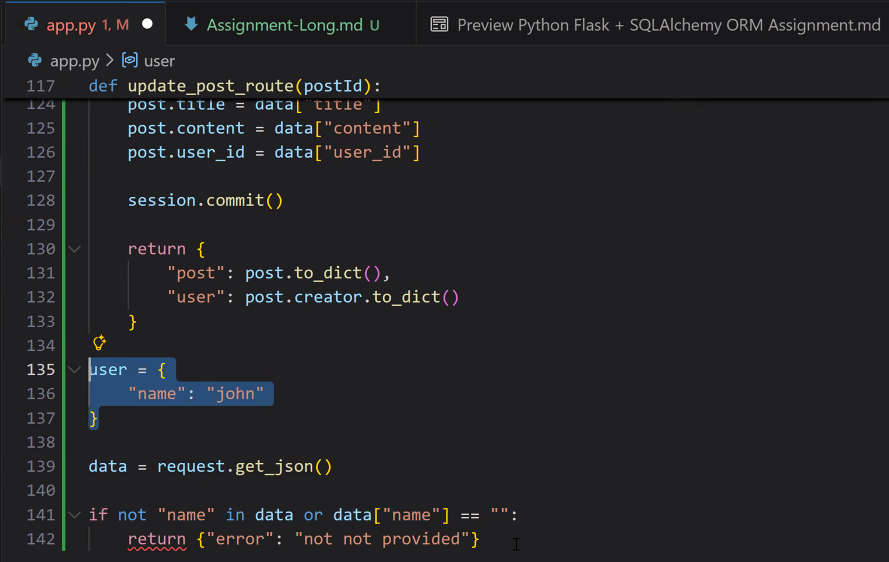

# Python Flask + SQLAlchemy ORM Assignment

## **Build a Flask API with SQLAlchemy ORM and One-to-Many Relationships**

---

## 🎯 **Objective**

In this assignment, you will build a Flask API using **SQLAlchemy ORM** to practice:

* Defining models with SQLAlchemy
* Creating **one-to-many relationships**
* Implementing basic **CRUD** operations with ORM
* Working with SQLAlchemy sessions

---

## 🧩 Step 1 — Project Setup

### 1. Create a Project Folder

```bash
mkdir flask_store_api
cd flask_store_api
```

### 2. Create and Activate Virtual Environment

#### Windows

```bash
python -m venv venv
venv\Scripts\activate
```

#### macOS/Linux

```bash
python3 -m venv venv
source venv/bin/activate
```

### 3. Install Required Packages

```bash
pip install flask sqlalchemy
```

---

## 🗃️ Step 2 — Create the Models (`models.py`)

Create a file named **`models.py`**.

### Import and Setup:

```python
from sqlalchemy import create_engine, ForeignKey
from sqlalchemy.orm import declarative_base, mapped_column, Mapped, sessionmaker, relationship

engine = create_engine("sqlite:///store.db", echo=True)
Base = declarative_base()
Session = sessionmaker(bind=engine)
```

---

### **A. Category Model**

Create a `Category` class:

| Field    | Type         | Notes                        |
| -------- | ------------ | ---------------------------- |
| id       | int          | Primary key                  |
| name     | str          | Required                     |
| products | relationship | One-to-many with Product     |

**Required method:**
* `to_dict()` - returns `{"id": ..., "name": ...}`

---

### **B. Product Model**

Create a `Product` class:

| Field       | Type         | Notes                        |
| ----------- | ------------ | ---------------------------- |
| id          | int          | Primary key                  |
| name        | str          | Required                     |
| price       | float        | Required                     |
| category_id | int          | Foreign key to categories.id |
| category    | relationship | Many-to-one with Category    |

**Required method:**
* `to_dict()` - returns all fields as a dictionary

**Example structure:**

```python
class Category(Base):
    __tablename__ = 'categories'
    
    id: Mapped[int] = mapped_column(primary_key=True)
    name: Mapped[str] = mapped_column()
    products: Mapped[list["Product"]] = relationship("Product", back_populates="category")
    
    def to_dict(self):
        # your code here
        pass
```

---

## 🌱 Step 3 — Seed the Database (`seed.py`)

Create **`seed.py`**:

```python
from models import Session, Base, engine, Category, Product

# Create all tables
Base.metadata.create_all(engine)

session = Session()

# Add 2 categories
electronics = Category(name="Electronics")
clothing = Category(name="Clothing")

session.add_all([electronics, clothing])
session.commit()

# Add 4 products (2 per category)
laptop = Product(name="Laptop", price=999.99, category_id=1)
mouse = Product(name="Mouse", price=25.50, category_id=1)
shirt = Product(name="T-Shirt", price=19.99, category_id=2)
jeans = Product(name="Jeans", price=49.99, category_id=2)

session.add_all([laptop, mouse, shirt, jeans])
session.commit()

print("Database seeded!")
session.close()
```

### Run:

```bash
python seed.py
```

---

## 🌐 Step 4 — Create the Flask App (`app.py`)

Create **`app.py`** and implement the following routes:

---

## 🔍 Required Routes

### 1. **GET `/categories`**

Return all categories.

**Example response:**

```json
[
  {"id": 1, "name": "Electronics"},
  {"id": 2, "name": "Clothing"}
]
```

**Hint:**

```python
@app.route("/categories")
def get_categories():
    # Convert to list of dictionaries
    # Return as JSON
```

---

### 2. **GET `/products`**

Return all products.

**Example response:**

```json
[
  {
    "id": 1,
    "name": "Laptop",
    "price": 999.99,
    "category_id": 1
  }
]
```

---

### 3. **GET `/products/<id>`**

Return a single product by ID.

**Success:**

```json
{
  "id": 1,
  "name": "Laptop",
  "price": 999.99,
  "category_id": 1
}
```

**If not found (404):**

```json
{"error": "product not found"}
```

---

### 4. **GET `/categories/<category_id>/products`**

Return all products in a category (using the relationship).

**Success:**

```json
[
  {"id": 1, "name": "Laptop", "price": 999.99, "category_id": 1},
  {"id": 2, "name": "Mouse", "price": 25.50, "category_id": 1}
]
```

**If category not found (404):**

```json
{"error": "category not found"}
```

**Hint:** Use `category.products` to access related products.

---

### 5. **POST `/products`**

Create a new product.

**Request body:**

```json
{
  "name": "Keyboard",
  "price": 79.99,
  "category_id": 1
}
```

**Validation:**
* `name` is required (non-empty string)
* `price` is required (positive number)
* `category_id` must exist

**Success response:**

```json
{
  "message": "product created",
  "product": {
    "id": 5,
    "name": "Keyboard",
    "price": 79.99,
    "category_id": 1
  }
}
```

**Error examples (400):**

```json
{"error": "name is required"}
```

```json
{"error": "price must be a positive number"}
```

```json
{"error": "category not found"}
```

---

### 6. **PUT `/products/<id>`**

Update a product.

**Same validation as POST.**

**Success:**

```json
{
  "message": "product updated",
  "product": {
    "id": 1,
    "name": "Gaming Laptop",
    "price": 1299.99,
    "category_id": 1
  }
}
```

**If not found (404):**

```json
{"error": "product not found"}
```

---

### 7. **DELETE `/products/<id>`**

Delete a product.

**Success:**

```json
{"message": "product deleted"}
```

**If not found (404):**

```json
{"error": "product not found"}
```

---

## 📋 Key Requirements

✔️ Use SQLAlchemy ORM (no raw SQL)  
✔️ Create a new session in each route  
✔️ Use `session.query()`, `.filter_by()`, `.first()`, `.all()`  
✔️ Use `session.add()`, `session.commit()`, `session.delete()`  
✔️ Return proper JSON responses  
✔️ Use correct HTTP status codes (200, 400, 404)  
✔️ Include validation in POST and PUT routes  

---

## 📄 Deliverables

Submit:

1. **`models.py`** - Both models with relationships
2. **`seed.py`** - Database seeding script
3. **`app.py`** - All 7 routes implemented
4. **`store.db`** - Generated database

---

## 🏁 Learning Outcomes

After this assignment, you will understand:

* How to define SQLAlchemy models
* How to create one-to-many relationships
* How to use `relationship()` and `back_populates`
* How to perform CRUD operations with ORM
* How to work with SQLAlchemy sessions
* How to validate data in Flask routes

---

## 💡 Quick Tips

* Copy structure from today's activity (User/Post example)
* Use `.to_dict()` to convert ORM objects to JSON
* Test one route at a time
* Use Postman or Thunder Client for POST/PUT/DELETE
* Check `store.db` is created after running seed.py